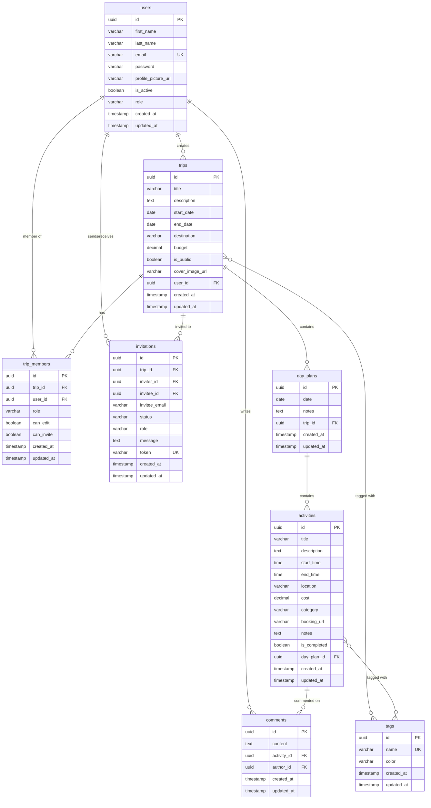

# Travel Itinerary Planner

A comprehensive full-stack application for planning and managing travel itineraries with collaborative features, built with Spring Boot 3, PostgreSQL, and React TypeScript.

## 🏗️ Architecture Overview

```
┌─────────────────┐    ┌──────────────────┐    ┌─────────────────┐
│   React Frontend │    │  Spring Boot API │    │   PostgreSQL    │
│   (Port 3000)    │◄──►│   (Port 8080)    │◄──►│   (Port 5432)   │
│                 │    │                  │    │                 │
│ • Vite + TS     │    │ • Spring Boot 3  │    │ • Database      │
│ • React Router  │    │ • Spring Security│    │ • Flyway        │
│ • React Query   │    │ • JWT Auth       │    │ • Migrations    │
│ • Tailwind CSS  │    │ • Swagger/OpenAPI│    │                 │
│ • Chart.js      │    │ • JPA/Hibernate  │    │                 │
└─────────────────┘    └──────────────────┘    └─────────────────┘
```

## 🚀 Quick Start

### Prerequisites

- Docker and Docker Compose
- Java 17+ (for local development)
- Node.js 18+ (for local development)

### Running with Docker Compose

1. Clone the repository:
```bash
git clone <repository-url>
cd Travel-Itinerary-Planner
```

2. Start all services:
```bash
docker-compose up --build
```

3. Access the application:
   - Frontend: http://localhost:3000
   - Backend API: http://localhost:8080/api
   - API Documentation: http://localhost:8080/swagger-ui.html

### Local Development Setup

#### Backend Setup

1. Navigate to the backend directory:
```bash
cd backend
```

2. Start PostgreSQL database:
```bash
docker run -d \
  --name travel-planner-postgres \
  -e POSTGRES_DB=travel_planner \
  -e POSTGRES_USER=travel_user \
  -e POSTGRES_PASSWORD=travel_password \
  -p 5432:5432 \
  postgres:15-alpine
```

3. Run the Spring Boot application:
```bash
./mvnw spring-boot:run
```

#### Frontend Setup

1. Navigate to the frontend directory:
```bash
cd frontend
```

2. Install dependencies:
```bash
npm install
```

3. Start the development server:
```bash
npm run dev
```

## 🗄️ Database Schema (ERD)



## 🔐 Authentication & Security

### JWT Authentication
- JWT tokens with 24-hour expiration
- Secure password hashing with BCrypt
- Role-based access control (USER, ADMIN)
- CORS configuration for cross-origin requests

### API Security
- All endpoints except `/api/auth/**` require authentication
- Bearer token authentication
- Spring Security configuration with custom JWT filter
- Input validation and sanitization

## 📚 API Documentation

### Authentication Endpoints

#### POST `/api/auth/signin`
Login with email and password.

**Request:**
```json
{
  "email": "user@example.com",
  "password": "password123"
}
```

**Response:**
```json
{
  "token": "eyJhbGciOiJIUzUxMiJ9...",
  "type": "Bearer",
  "id": "uuid",
  "email": "user@example.com",
  "firstName": "John",
  "lastName": "Doe",
  "role": "USER"
}
```

#### POST `/api/auth/signup`
Register a new user account.

**Request:**
```json
{
  "firstName": "John",
  "lastName": "Doe",
  "email": "user@example.com",
  "password": "password123"
}
```

### Trip Management Endpoints

#### GET `/api/trips`
Get user's trips with pagination.

**Query Parameters:**
- `page`: Page number (default: 0)
- `size`: Page size (default: 20)

#### POST `/api/trips`
Create a new trip.

**Request:**
```json
{
  "title": "Summer Vacation",
  "description": "A relaxing summer trip",
  "startDate": "2024-07-01",
  "endDate": "2024-07-10",
  "destination": "Bali, Indonesia",
  "budget": 2000.00,
  "isPublic": false,
  "tagNames": ["vacation", "beach"]
}
```

#### GET `/api/trips/{tripId}`
Get trip details by ID.

#### PUT `/api/trips/{tripId}`
Update trip information.

#### DELETE `/api/trips/{tripId}`
Delete a trip (owner only).

### Activity Management Endpoints

#### GET `/api/dayplans/{dayPlanId}/activities`
Get activities for a specific day plan.

#### POST `/api/dayplans/{dayPlanId}/activities`
Create a new activity.

**Request:**
```json
{
  "title": "Visit Temple",
  "description": "Explore ancient temple complex",
  "startTime": "09:00",
  "endTime": "11:00",
  "location": "Ubud, Bali",
  "cost": 25.00,
  "category": "SIGHTSEEING",
  "notes": "Bring camera"
}
```

#### PUT `/api/activities/{activityId}`
Update activity details.

#### DELETE `/api/activities/{activityId}`
Delete an activity.

#### PATCH `/api/activities/{activityId}/toggle-completion`
Toggle activity completion status.

### Analytics Endpoints

#### GET `/api/analytics/trips/{tripId}/cost-breakdown`
Get detailed cost analysis for a trip.

**Response:**
```json
{
  "totalCost": 1250.50,
  "costByCategory": {
    "DINING": 450.00,
    "TRANSPORTATION": 300.00,
    "ACCOMMODATION": 500.50
  },
  "costByDay": {
    "2024-07-01": 200.00,
    "2024-07-02": 150.50
  },
  "totalActivities": 15,
  "activitiesWithCost": 8
}
```

## 🎨 Frontend Features

### Pages
1. **Login/Register** - User authentication
2. **Trips List** - Overview of all user trips
3. **Trip Detail** - Detailed trip information and quick actions
4. **Calendar View** - Visual calendar showing trip timeline
5. **Day View** - Detailed daily activities with CRUD operations
6. **Costs Analysis** - Interactive charts and cost breakdown

### Key Components
- **Responsive Design** - Mobile-first approach with Tailwind CSS
- **Interactive Charts** - Cost visualization with Chart.js
- **Form Validation** - React Hook Form with validation
- **Loading States** - Proper loading indicators throughout
- **Error Handling** - User-friendly error messages
- **Toast Notifications** - Real-time feedback for user actions

### State Management
- **React Query** - Server state management and caching
- **Context API** - Authentication state management
- **Local Storage** - Token persistence

## 🐳 Docker Configuration

### Services
1. **PostgreSQL Database** (Port 5432)
   - Persistent data storage
   - Health checks
   - Automatic database initialization

2. **Spring Boot API** (Port 8080)
   - Multi-stage Docker build
   - Health checks
   - Non-root user for security

3. **React Frontend** (Port 3000)
   - Nginx serving static files
   - API proxy configuration
   - Optimized production build

### Environment Variables

#### Backend
- `DB_USERNAME`: Database username
- `DB_PASSWORD`: Database password
- `JWT_SECRET`: JWT signing secret
- `ALLOWED_ORIGINS`: CORS allowed origins

#### Frontend
- `VITE_API_URL`: Backend API URL

## 📊 Features Overview

### Core Features
- ✅ User registration and authentication
- ✅ Trip creation and management
- ✅ Day-by-day itinerary planning
- ✅ Activity management with categories
- ✅ Cost tracking and budget management
- ✅ Interactive calendar view
- ✅ Cost analysis with charts
- ✅ Tag system for organization
- ✅ Responsive web design

### Advanced Features
- ✅ JWT-based authentication
- ✅ Role-based access control
- ✅ Database migrations with Flyway
- ✅ API documentation with Swagger
- ✅ Docker containerization
- ✅ Production-ready configuration
- ✅ Health checks and monitoring
- ✅ CORS configuration
- ✅ Input validation and sanitization

### Planned Features (Future Enhancements)
- 🔄 Trip member management and collaboration
- 🔄 Email invitations system
- 🔄 Real-time notifications
- 🔄 File upload for images
- 🔄 Trip sharing and public trips
- 🔄 Mobile app (React Native)
- 🔄 Integration with booking platforms
- 🔄 Expense splitting among members

## 🧪 Testing

### Backend Testing
```bash
cd backend
./mvnw test
```

### Frontend Testing
```bash
cd frontend
npm run test
```

## 🚀 Deployment

### Production Deployment
1. Set environment variables for production
2. Configure SSL/TLS certificates
3. Set up reverse proxy (Nginx)
4. Configure database backups
5. Set up monitoring and logging

### Environment Configuration
Create `.env` files for different environments:

**.env.production**
```
DB_USERNAME=prod_user
DB_PASSWORD=secure_password
JWT_SECRET=your_secure_jwt_secret_here
ALLOWED_ORIGINS=https://yourdomain.com
```

## 🤝 Contributing

1. Fork the repository
2. Create a feature branch
3. Make your changes
4. Add tests if applicable
5. Submit a pull request

## 📄 License

This project is licensed under the MIT License - see the [LICENSE](LICENSE) file for details.

## 📞 Support

For support, please create an issue in the GitHub repository or contact the development team.

---

**Built with ❤️ using Spring Boot, React, and PostgreSQL**
